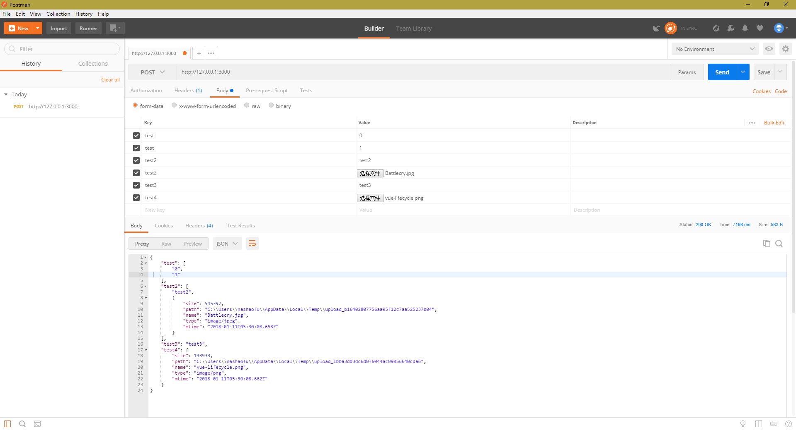

# koa-parser[](https://travis-ci.org/nashaofu/koa-parser)
a body parser for koa. support json, form(urlencoded), multipart and text type body.

## Install

[](https://nodei.co/npm/koa-parser/)

## Usage

```js
const Koa = require('koa')
const parser = require('koa-parser)

const port = 3000
const app = new Koa()

app.use(parser())

app.use(async (ctx, next) => {
  // if nothing was parsed, body will be undefined
  if (ctx.request.body !== undefined) {
    ctx.body = ctx.request.body
  }
  await next()
})

app.listen(port)
console.error(`listening on port ${port}`)
```

## Screenshot



## Options

```js
app.use(parser({
  encoding: 'utf-8', // requested encoding
  error: false, // support custom parser error handle
  json: true, // support json parser
  multipart: true, // support multipart(form-data) parser
  text: true, // support text parser
  urlencoded: true // support urlencoded(form) parser
}))
```

* **encoding**: requested encoding. Default is ``utf-8``

* **error**: support custom error handle, Default is ``false``. if koa-bodyparser throw an error, you can customize the response like:
  ```js
  app.use(parser({
    error (err, ctx) {
      console.log(err)
    }
  }))
  ```

* **json**: support json parser, Default is ``true``

* **multipart**: support multipart(form-data) parser, Default is ``true``

* **text**: support text parser, Default is ``true``

* **urlencoded**: support urlencoded(form) parser, Default is ``true``

## Licences

[MIT](LICENSE)
